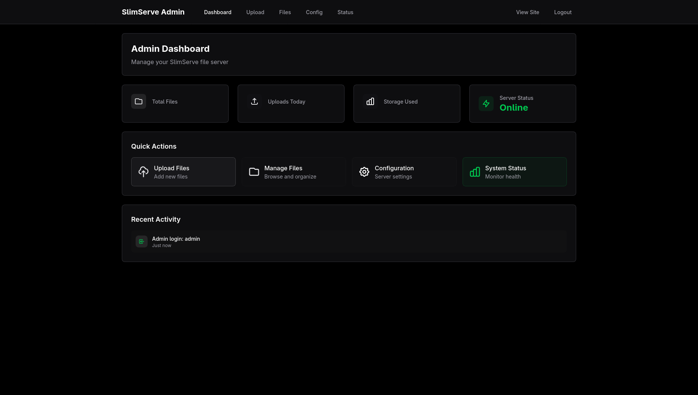
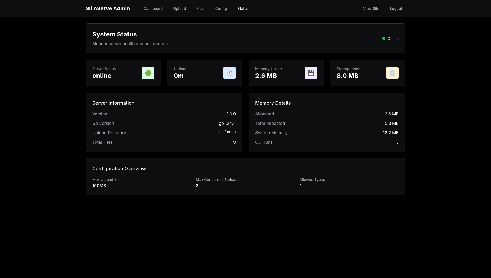
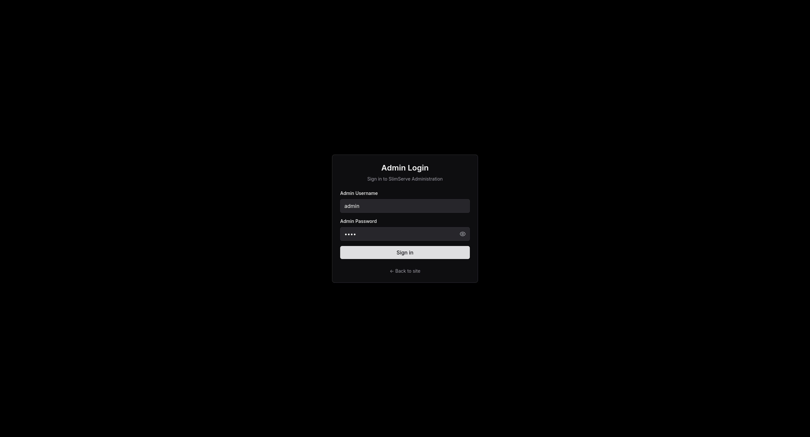
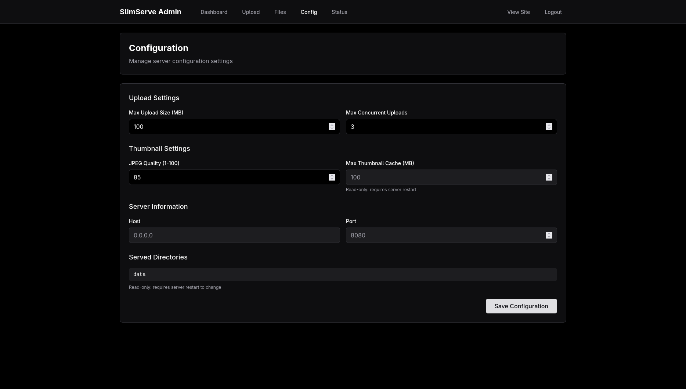
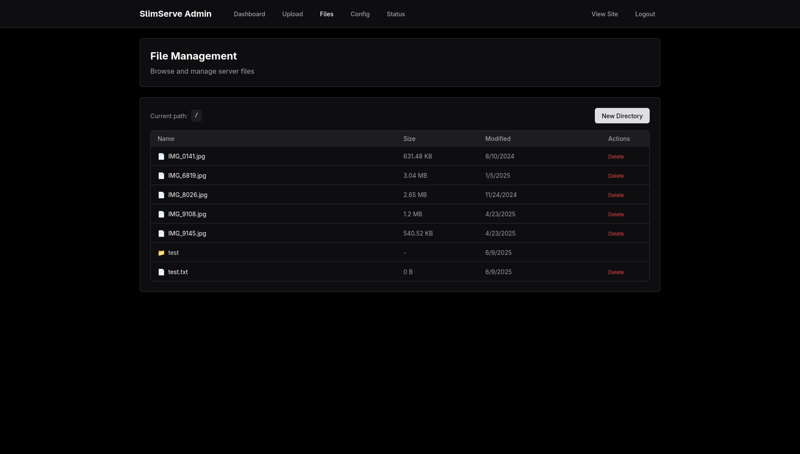
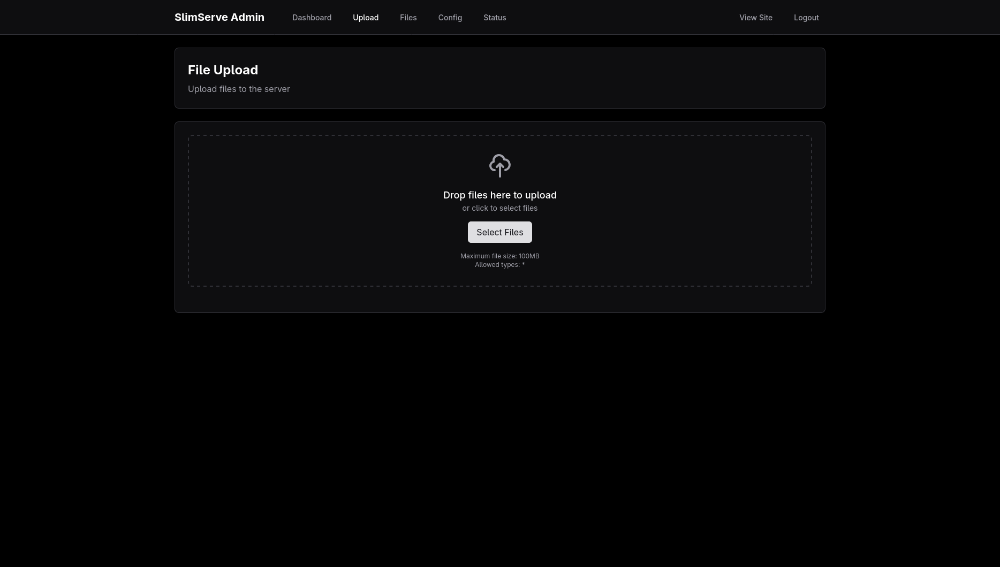

# SlimServe

[](https://goreportcard.com/report/github.com/xeome/slimserve)
[](https://codecov.io/gh/xeome/slimserve)
[](https://github.com/xeome/slimserve/pkgs/container/slimserve)
[](LICENSE)
[](https://golang.org/dl/)

> A lightweight HTTP file server designed with simplicity and security in mind.

SlimServe is a minimalistic and efficient file-serving application that provides seamless file sharing over HTTP with minimal dependencies, configuration, and resource usage. Built with a philosophy of being simple, fast, and easy to use.

## Features

- 🚀 **Single-binary deployment** with embedded assets (no external dependencies)
- 🔧 **Zero configuration** by default with sensible defaults
- 🔒 **Secure file serving** with directory whitelisting and path traversal protection
- 🎨 **Modern responsive web interface** with grid/list views and dark mode
- 🖼️ **On-demand thumbnail generation** for images (JPEG, PNG, GIF, WebP)
- 📝 **Structured logging** with configurable levels
- 🔐 **Configurable dot-file protection** and cookie-based session authentication
- 👑 **Admin interface** with secure file upload and server management
- 📤 **File upload** with validation, size limits, and type checking
- 🛡️ **Security features** including CSRF protection, rate limiting, and input validation
- 🐳 **Docker deployment support** (23.9MB production image)
- 🧪 **Comprehensive security fuzzing** infrastructure
- 🌐 **Cross-platform support** Linux, BSD, macOS, Windows (Only Linux is tested)
- ⚡ **Lightweight and fast** - minimal resource usage

---

## Screenshots

A quick visual tour of SlimServe’s interface and admin tools:

<table>
  <tr>
    <td align="center">
      <br>
      <sub><b>Dashboard</b><br><i>Server overview and quick stats</i></sub>
    </td>
    <td align="center">
      <br>
      <sub><b>Status</b><br><i>Real-time system & performance</i></sub>
    </td>
  </tr>
  <tr>
    <td align="center">
      <br>
      <sub><b>Admin Login</b><br><i>Dedicated, secure admin login page</i></sub>
    </td>
    <td align="center">
      <br>
      <sub><b>Config Panel</b><br><i>Live runtime configuration and settings</i></sub>
    </td>
  </tr>
  <tr>
    <td align="center">
      <br>
      <sub><b>File Management</b><br><i>Browse, organize, and delete uploads</i></sub>
    </td>
    <td align="center">
      <br>
      <sub><b>File Upload</b><br><i>Drag & drop with validation</i></sub>
    </td>
  </tr>
</table>

---

## Quick Start

### Binary Installation

```bash
# Build from source
git clone https://github.com/xeome/slimserve.git
cd slimserve
make build

# Run with default settings
./slimserve -dirs ./data
```

### Docker Compose (Recommended)

```bash
# Change workdir to manifests/docker/
cd manifests/docker

# Create data directory
mkdir -p data

# Build and start the service
docker-compose up -d

# View logs
docker-compose logs -f slimserve

# Stop the service
docker-compose down
```

### Kubernetes
If you're using Helm v3.7.x or earlier, you need to manually enable OCI support using an environment variable:
```bash
export HELM_EXPERIMENTAL_OCI=1
```

#### Installing

```bash
# Deploy SlimServe
helm install slimserve oci://ghcr.io/xeome/slimserve-helm --version 1.0.0 --namespace slimserve --create-namespace
```

### Manual Docker Run

```bash
# Pull the image from GitHub Container Registry
docker pull ghcr.io/xeome/slimserve:latest

# Run with mounted directory
docker run --rm -p 8080:8080 -v $(pwd)/data:/data ghcr.io/xeome/slimserve:latest

# Run with custom config file
docker run --rm -p 8080:8080 \
  -v $(pwd)/data:/data \
  -v $(pwd)/my-config.json:/etc/slimserve/config.json:ro \
  ghcr.io/xeome/slimserve:latest
```

## Configuration

SlimServe supports multiple configuration methods with the following priority order:

| Source                | Priority    | Description                                 |
| --------------------- | ----------- | ------------------------------------------- |
| CLI flags             | 4 (highest) | Command-line arguments                      |
| Environment variables | 3           | `SLIMSERVE_*` prefixed variables            |
| JSON config file      | 2           | Configuration file (default: `config.json`) |
| Defaults              | 1 (lowest)  | Built-in sensible defaults                  |

### Environment Variables

Override any configuration setting using environment variables:

- `SLIMSERVE_HOST` - Server host (default: `0.0.0.0`)
- `SLIMSERVE_PORT` - Server port (default: `8080`)
- `SLIMSERVE_DIRS` - Comma-separated list of directories to serve
- `SLIMSERVE_DISABLE_DOTFILES` - Disable dot files (`true`=disable, `false`=allow, default: `true`)
- `SLIMSERVE_LOG_LEVEL` - Log level (`debug`, `info`, `warn`, `error`)
- `SLIMSERVE_ENABLE_AUTH` - Enable session-based authentication (`true`/`false`)
- `SLIMSERVE_USERNAME` - Username for authentication
- `SLIMSERVE_PASSWORD` - Password for authentication
- `SLIMSERVE_THUMB_CACHE_MB` - Thumbnail cache size in MB (default: `100`)
- `SLIMSERVE_IGNORE_PATTERNS` - Comma-separated list of glob patterns to ignore (e.g., `*.log,tmp/`)
- `SLIMSERVE_THUMB_MAX_FILE_SIZE_MB` - Maximum file size in MB for thumbnail generation (default: `10`)
- `CONFIG_FILE` - Path to JSON config file

### Configuration File

Create a JSON configuration file (see [`example-config.json`](example-config.json)):

```json
{
  "host": "0.0.0.0",
  "port": 8080,
  "directories": ["/data", "/shared"],
  "disable_dot_files": true,
  "log_level": "info",
  "enable_auth": false,
  "username": "",
  "password": "",
  "thumb_cache_mb": 100,
  "thumb_max_file_size_mb": 10,
  "ignore_patterns": ["*.tmp", ".git/"]
}
```

## Usage

SlimServe can be run directly with command-line flags or configured via a JSON file.

### Command-line flags

| Flag                      | Environment Variable               | Default   | Description                             |
| ------------------------- | ---------------------------------- | --------- | --------------------------------------- |
| `-host`                   | `SLIMSERVE_HOST`                   | `0.0.0.0` | Host address to bind to                 |
| `-port`                   | `SLIMSERVE_PORT`                   | `8080`    | Port to listen on                       |
| `-dirs`                   | `SLIMSERVE_DIRS`                   | `.`       | Directories to serve (comma-separated)  |
| `-config`                 | `SLIMSERVE_CONFIG`                 | -         | Path to JSON configuration file         |
| `-log-level`              | `SLIMSERVE_LOG_LEVEL`              | `info`    | Logging level: debug, info, warn, error |
| `-disable-dotfiles`       | `SLIMSERVE_DISABLE_DOTFILES`       | `true`    | Disable serving dot-files for security  |
| `-enable-auth`            | `SLIMSERVE_ENABLE_AUTH`            | `false`   | Enable session-based authentication     |
| `-username`               | `SLIMSERVE_USERNAME`               | -         | Username for authentication             |
| `-password`               | `SLIMSERVE_PASSWORD`               | -         | Password for authentication             |
| `-thumb-cache-mb`         | `SLIMSERVE_THUMB_CACHE_MB`         | `100`     | Thumbnail cache size in MB              |
| `-thumb-max-file-size-mb` | `SLIMSERVE_THUMB_MAX_FILE_SIZE_MB` | `10`      | Maximum file size for thumbnails (MB)   |
| `-ignore-patterns`        | `SLIMSERVE_IGNORE_PATTERNS`        | -         | Comma-separated glob patterns to ignore |

### Example usage

```bash
# Serve current directory
./slimserve

# Serve specific directories on custom port
./slimserve -port 3000 -dirs "/home/user/docs,/var/www"

# Use configuration file
./slimserve -config config.json

# Enable debug logging and allow dot-files
./slimserve -log-level debug -disable-dotfiles=false

# Enable session-based authentication
./slimserve -enable-auth -username alice -password secret

# Enable admin interface with file upload
./slimserve -enable-admin -admin-username admin -admin-password secure123
```

## Admin Interface

SlimServe includes a secure admin interface for file management and server administration.

### Enabling Admin Interface

```bash
# Enable admin interface with credentials
./slimserve -enable-admin -admin-username admin -admin-password secure123

# Or via environment variables
export SLIMSERVE_ENABLE_ADMIN=true
export SLIMSERVE_ADMIN_USERNAME=admin
export SLIMSERVE_ADMIN_PASSWORD=secure123
./slimserve
```

### Admin Features

- **Dashboard**: System statistics and server status monitoring
- **File Upload**: Secure multi-file upload with validation
- **File Management**: Browse, delete, and organize uploaded files
- **Configuration**: Runtime configuration management
- **System Status**: Memory usage, uptime, and performance metrics

### Admin Security

- **Separate Authentication**: Admin uses separate credentials from regular users
- **CSRF Protection**: All admin operations protected against CSRF attacks
- **Rate Limiting**: Prevents brute force attacks on admin endpoints
- **Input Validation**: Comprehensive validation of all admin inputs
- **File Type Restrictions**: Configurable allowed file types for uploads
- **Size Limits**: Configurable maximum file size and concurrent uploads

### Admin Configuration

| Flag                      | Environment Variable               | Default                                | Description            |
| ------------------------- | ---------------------------------- | -------------------------------------- | ---------------------- |
| `-enable-admin`           | `SLIMSERVE_ENABLE_ADMIN`           | `false`                                | Enable admin interface |
| `-admin-username`         | `SLIMSERVE_ADMIN_USERNAME`         | -                                      | Admin username         |
| `-admin-password`         | `SLIMSERVE_ADMIN_PASSWORD`         | -                                      | Admin password         |
| `-admin-upload-dir`       | `SLIMSERVE_ADMIN_UPLOAD_DIR`       | `./uploads`                            | Upload directory       |
| `-max-upload-size-mb`     | `SLIMSERVE_MAX_UPLOAD_SIZE_MB`     | `100`                                  | Max upload size (MB)   |
| `-allowed-upload-types`   | `SLIMSERVE_ALLOWED_UPLOAD_TYPES`   | `jpg,jpeg,png,gif,webp,pdf,txt,md,zip` | Allowed file types     |
| `-max-concurrent-uploads` | `SLIMSERVE_MAX_CONCURRENT_UPLOADS` | `3`                                    | Max concurrent uploads |

### Accessing Admin Interface

Once enabled, access the admin interface at `/admin`. You'll be prompted to log in with your admin credentials.

## Security Features

- **Path Traversal Protection**: Uses Go 1.24's `os.Root` for traversal-resistant file operations
- **Directory Whitelisting**: Only serves explicitly configured directories
- **Dot-file Protection**: Configurable blocking of hidden files (enabled by default)
- **Non-root Container**: Docker container runs as UID 1001 for security
- **Cookie-based Session Authentication**: In-memory session management with automatic logout on server restart
- **File Ignoring**: Ignore files and directories using global patterns or `.slimserveignore` files.
- **Security Fuzzing**: Comprehensive fuzzing tests for vulnerability detection

### File Ignoring

You can control which files and directories are served using two methods:

1.  **Global Ignore Patterns**: Use the `-ignore-patterns` flag or the `SLIMSERVE_IGNORE_PATTERNS` environment variable to provide a comma-separated list of glob patterns. These rules are applied to all served directories.
   ```bash
   # Ignore all .log files and the tmp/ directory
   ./slimserve -ignore-patterns "*.log,tmp/"
   ```

2.  **`.slimserveignore` Files**: For more granular control, create a `.slimserveignore` file in any directory you are serving. This file works much like a `.gitignore` file.
   - Each line in the file is a glob pattern.
   - Patterns are relative to the directory containing the `.slimserveignore` file.
   - Comments start with `#`.
   - The `.slimserveignore` file itself is always hidden.

   **Example `.slimserveignore`:**
   ```
   # Ignore node_modules
   node_modules/

   # Ignore temporary files
   *.tmp
   *.bak
   ```

All ignore rules (global and from `.slimserveignore` files) are combined. A file is hidden if it matches any rule.

## Thumbnail Generation

SlimServe automatically generates thumbnails for supported image formats:

- **Supported formats**: JPEG, PNG, GIF, WebP
- **On-demand generation**: Thumbnails created only when requested
- **Intelligent caching**: Four-step cache-key algorithm detects file changes
- **Automatic pruning**: Configurable cache size with LRU eviction
- **Performance optimized**: Efficient image scaling algorithms

Configure thumbnail cache size:
```bash
export SLIMSERVE_THUMB_CACHE_MB=200  # 200MB cache
```

## Development

### Building

```bash
# Build binary
make build

# Run tests
make test

# Run security fuzz tests
make fuzz-short    # 30 seconds
make fuzz-long     # 5 minutes each test

# Build Docker image
make docker-build

# Clean build artifacts
make clean
```

### Testing

The project includes comprehensive testing:

- **Unit tests**: 229 test cases with 88.6% coverage
- **Fuzz testing**: Security-focused fuzzing for path traversal, thumbnails, and static assets
- **Integration tests**: End-to-end Docker deployment testing

```bash
# Run all tests
go test ./...

# Run tests with coverage
go test -cover ./...

# Run fuzz tests
go test ./internal/server -fuzz=FuzzRequestPath -fuzztime=30s
```

See [`FUZZING.md`](FUZZING.md) for detailed security testing information.

## Docker Deployment

### Production Deployment

The Docker image is optimized for production use:

- **Image size**: ~24MB (Alpine-based)
- **Memory usage**: <50MB typical
- **CPU usage**: Minimal under normal load
- **Security**: Runs as non-root user (UID 1001)

### Health Checks

Built-in health check endpoint:
```bash
curl http://localhost:8080/
```

Docker health check is automatically configured with 30-second intervals.

## API

SlimServe provides a simple HTTP API:

- `GET /` - Directory listing or file serving
- `GET /path/to/file` - Serve specific file
- `GET /path/to/image?thumb=1` - Serve thumbnail for images
- `GET /path/to/dir/` - Directory listing with navigation

All responses include appropriate MIME types and security headers.

## Performance

- **Startup time**: <100ms typical
- **Memory footprint**: <50MB under normal load
- **Concurrent connections**: Handles hundreds of simultaneous requests
- **Static asset serving**: Embedded assets served from memory
- **Thumbnail caching**: Efficient caching reduces regeneration overhead

## Contributing

We welcome contributions! Please:

1. Fork the repository
2. Create a feature branch (`git checkout -b feature/amazing-feature`)
3. Make your changes and add tests
4. Ensure code passes: `go fmt`, `go vet`, `make test`
5. Run security tests: `make fuzz-short`
6. Commit your changes (`git commit -m 'Add amazing feature'`)
7. Push to the branch (`git push origin feature/amazing-feature`)
8. Open a Pull Request

### Code Style

- Follow standard Go formatting (`go fmt`)
- Add tests for new functionality
- Update documentation as needed
- Run `go vet` before submitting

## Roadmap

- [ ] File uploads
- [ ] Video thumbnail generation
- [ ] File search and indexing

## License

This project is licensed under the GNU General Public License v3.0 - see the [LICENSE](LICENSE) file for details.

## Acknowledgements

SlimServe is built with these excellent open-source projects:

- [Gin](https://github.com/gin-gonic/gin) - HTTP web framework
- [Zerolog](https://github.com/rs/zerolog) - Structured logging
- [Tailwind CSS](https://tailwindcss.com/) - Utility-first CSS framework
- [Alpine.js](https://alpinejs.dev/) - Lightweight JavaScript framework
- [Heroicons](https://heroicons.com/) - Beautiful hand-crafted SVG icons

---

**SlimServe** - Simple, secure, and efficient file serving. 🚀
